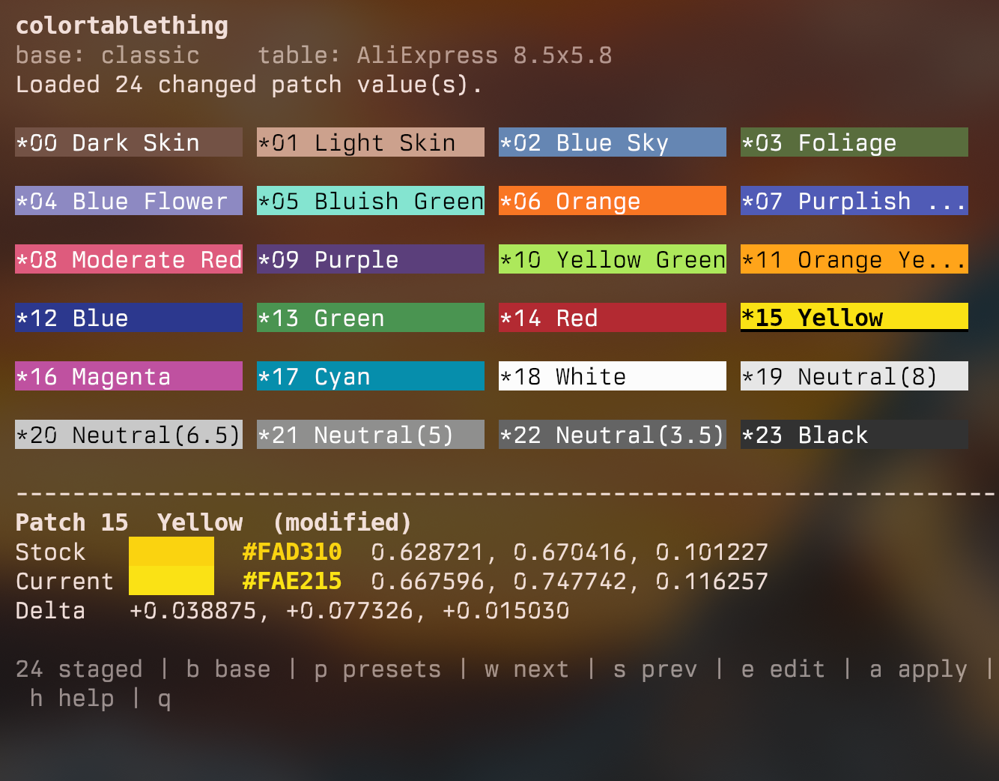

# colortablething

`colortablething` is a single-file Python tool for editing DaVinci Resolve Color Match reference chart values.

It lets you choose a Resolve built-in chart slot, called the **base**, then replace its 24 reference patch values with values from a built-in table, XML file, JSON file, CSV file, or manual edits.

The normal workflow is:

```bash
python3 colortablething.py --table type8 --dry-run
python3 colortablething.py --table type8 --yes
```

Built-in AliExpress tables are already mapped to the correct Resolve base chart (`classic`). You can still override the base manually:

```bash
python3 colortablething.py --base legacy --table type9 --dry-run
```

## Features

- Interactive terminal UI with live color previews.
- Responsive layout that redraws on terminal resize.
- CLI mode for skipping the TUI entirely.
- Built-in tables:
  - [`AliExpress 8.5x5.8`](https://aliexpress.com/item/1005012329421609.html) (`type8`, big chart)
  - [`AliExpress Chart 2026`](https://aliexpress.com/item/1005002513039230.html) (`type9`, small chart)
- Adds user tables from JSON, Resolve XML, RGB XML, or CSV.
- Exports staged/current values as JSON or Resolve XML.
- Creates backups before modifying the Resolve binary.
- Refuses to patch while Resolve is running unless explicitly overridden.
- Uses only the Python standard library.

## Screenshot



## Compatibility

So far this has been tested on Linux only, with DaVinci Resolve 20 and 21. The normal chart replacement workflow should work on Windows and macOS too, but those platforms still need real-world testing.

## Download

Clone or download this repository, then run the script directly:

```bash
python3 colortablething.py
```

On Linux/macOS you can also make it executable:

```bash
chmod +x colortablething.py
./colortablething.py
```

## TUI Usage

Launch the TUI with no arguments:

```bash
python3 colortablething.py
```

Common keys:

```text
h       full help
b       next base chart
p       presets/table picker
w       next preset/table
s       previous preset/table
e       edit selected patch
a       apply staged values to Resolve
q       quit
```

In the preset picker:

```text
a       add a table file to the user table library
h       explain accepted table formats
r       rename a user table
d       delete a user table
Enter   load selected table
```

## CLI Usage

Preview a built-in table without writing anything:

```bash
python3 colortablething.py --table type8 --dry-run
```

Apply a built-in table:

```bash
python3 colortablething.py --table type8 --yes
```

Use a specific base chart:

```bash
python3 colortablething.py --base classic --table type9 --dry-run
python3 colortablething.py --base legacy --table type9 --dry-run
```

Use an XML file directly:

```bash
python3 colortablething.py --base classic --table /path/to/mychart.xml --dry-run
python3 colortablething.py --base classic --xml /path/to/mychart.xml --yes
```

Add a reusable user table:

```bash
python3 colortablething.py --add-table /path/to/mychart.xml --table-name "My Printed Chart"
python3 colortablething.py --table "My Printed Chart" --dry-run
```

List available tables and base slots:

```bash
python3 colortablething.py --list-tables
python3 colortablething.py --list-slots
```

Export current or staged values:

```bash
python3 colortablething.py --base classic --export-json classic.json
python3 colortablething.py --base classic --export-xml classic.xml
```

## Base Charts

The base chart is the Resolve built-in chart slot whose layout/geometry is used.

Common base aliases:

```text
classic    Calibrite ColorChecker Classic
legacy     Calibrite ColorChecker Classic - Legacy
spyder     Datacolor SpyderCheckr 24
smpte      DSC Labs SMPTE OneShot
chroma     DSC Labs ChromaDuMonde 24+4
video      Calibrite ColorChecker Video
passport   Calibrite ColorChecker Passport Video
```

Built-in ColorChecker-style AliExpress tables default to `classic` automatically.

## AliExpress Tables

The included AliExpress presets target these chart variants:

- Big chart: [`AliExpress 8.5x5.8`](https://aliexpress.com/item/1005012329421609.html), available as `type8`.
- Small chart: [`AliExpress Chart 2026`](https://aliexpress.com/item/1005002513039230.html), available as `type9`.

The generic aliases `aliexpress`, `ali`, and `8.5x5.8` point to the big chart preset.

## XML Table Format

Resolve-style XML should contain 24 grids, indexed `0` through `23`:

```xml
<colorchart name="My Chart" type="7">
  <grid index="0" name="Dark Skin"><color xyz="0.111, 0.101, 0.070"/></grid>
  <!-- 22 more grids -->
  <grid index="23" name="Black"><color xyz="0.030, 0.032, 0.035"/></grid>
</colorchart>
```

Only the `xyz` attribute is used for matching. Other attributes may be present.

RGB table XML also works:

```xml
<colors>
  <color no="001"><R>115</R><G>82</G><B>69</B></color>
  <!-- no="024" maps to patch index 23 -->
</colors>
```

## Safety

This tool modifies the Resolve executable when you apply changes. Use `--dry-run` first.

Safety behavior:

- Creates backups in `~/.local/share/colorchecker_backups` by default.
- Patches only fixed-size compressed chart XML streams.
- Refuses to patch while Resolve appears to be running.
- Verifies changes after writing.

Useful flags:

```bash
--dry-run        preview only
--yes            skip confirmation prompt
--wait-resolve   wait until Resolve closes
--kill-resolve   ask before terminating Resolve
--force          bypass running-process guard
--restore        restore latest backup
```

## Extra Dropdown Entries

The script also contains an experimental installer for extra Resolve Color Match dropdown entries:

```bash
python3 colortablething.py --install-type8 --dry-run
python3 colortablething.py --install-type9 --xml /path/to/chart2026.xml --dry-run
```

This path is intended for the supported Linux Resolve binary layout and validates exact bytes before writing. The normal table replacement workflow is more portable.

## Disclaimer

This project is not affiliated with Blackmagic Design. It patches local files on your machine. Keep backups and use it at your own risk.

For safety and compliance transparency: the project author used DeepSeek V4 Flash to help dig through DaVinci Resolve behavior and write parts of the documentation. Review the code and dry-run output yourself before applying patches.
